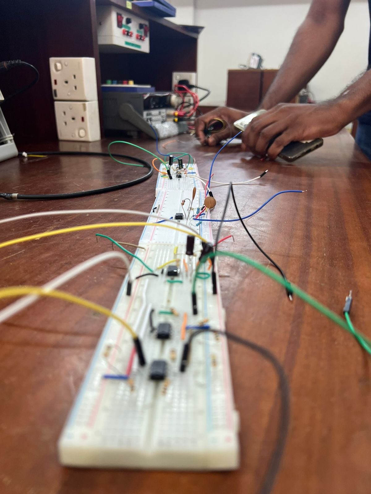
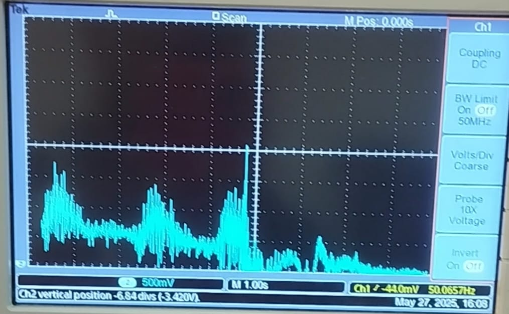

# 💪 EMG-Based Muscle Strength Indicator

This project is an **Electromyography (EMG)-based strength indicator** that lights up LEDs according to the muscle activation level. It uses **dry electrodes**, **analog filtering and amplification**, and **signal conditioning** to give real-time muscle activity feedback — ideal for educational, prosthetic, or physiotherapy applications.

---

## 🔧 System Overview

**Components Used:**
- **Dry EMG Electrodes** – to detect muscle signals
- **INA128 Instrumentation Amplifier** – for initial low-noise signal amplification
- **Two 2nd-order Sallen-Key Low-Pass Filters (Cascaded)** – to reduce high-frequency noise and EMG artifacts
- **Full-Wave Precision Rectifier** – to convert the bipolar EMG signal into a unipolar signal
- **Comparator Circuit** – to compare signal thresholds and drive LEDs based on muscle strength

---

## ⚙️ Circuit Stages

1. **Electrode Placement**
   - Dry electrodes placed on the skin surface over the target muscle (e.g., biceps).

2. **Signal Amplification (INA128)**
   - Amplifies the raw EMG signal (µV-level) to a readable voltage level.
   - Gain is set to 200 using R_G = 253 ohms.
   - 9 V voltage supply

3. **Filtering**
   - Two cascaded **Sallen-Key 2nd-order Low-Pass Filters**.
   - Cutoff frequency ~490 Hz to retain EMG envelope and remove high-frequency noise.
   - +9 V,-9V supply voltages

4. **Full-Wave Precision Rectifier**
   - Converts the AC EMG signal into a positive voltage envelope.

5. **Comparator Stage**
   - Compares the processed signal against preset thresholds.
   - Drives 3 LEDs to indicate increasing levels of muscle activation.


---


## 📈 LED Strength Indication

| LED Count | Muscle Activation Level |
|-----------|--------------------------|
| 1 LED     | Weak / resting activity  |
| 2 LED  | Moderate contraction     |
| 3 LED  | Strong contraction       |

---

## 🖼️ Block Diagram

```plaintext
[Dry Electrodes] 
     ↓
[INA128 Instrumentation Amplifier]
     ↓
[Sallen-Key LPF #1] → [Sallen-Key LPF #2]
     ↓
[Full-Wave Precision Rectifier]
     ↓
[Comparator Circuit]
     ↓
[LED Display]
```
## 📈 Applications

This EMG-based strength indicator has diverse use cases across healthcare, sports, and education:

---

- **🩺 Rehabilitation Therapy**  
  Provides visual feedback for patients recovering from injuries or surgeries. Helps monitor and motivate muscle engagement.

- **🦿 Prosthetic Control**  
  Can be adapted to trigger movements in prosthetic limbs using muscle signals.

- **🏋️ Sports Performance**  
  Allows athletes to observe muscle engagement levels during training and optimize routines.

- **📟 Wearable Biofeedback**  
  Can be miniaturized and worn to continuously monitor muscle activity for stress or fatigue tracking.

- **🏫 Biomedical Education**  
  A practical tool to demonstrate signal acquisition, conditioning, and interpretation of EMG signals.

---

